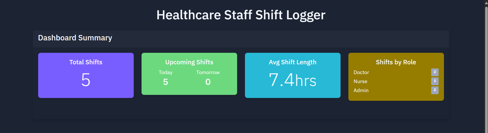
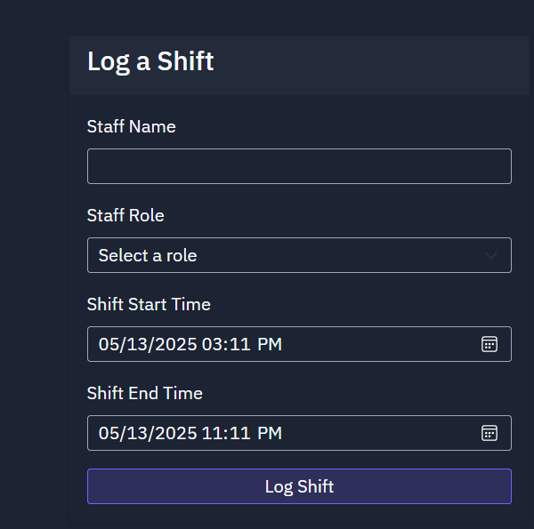
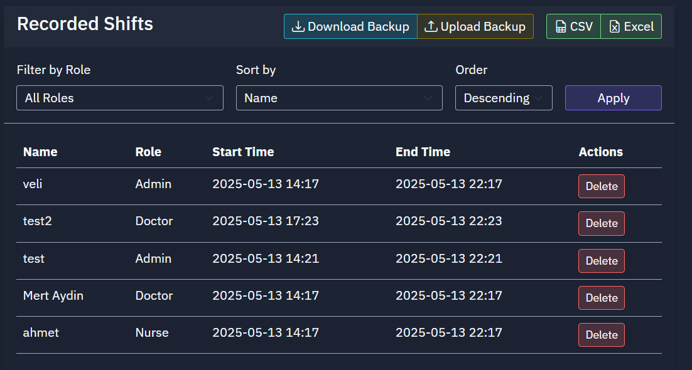

# Healthcare Staff Shift Logger

A lightweight, user-friendly web application built with Flask that enables healthcare facilities to efficiently log, track, and manage staff shift information.

https://github.com/Mert.Aydin7/healthcare-staff-shift-logger/screenshots/preview.mp4

## Project Description

The Healthcare Staff Shift Logger is a simple yet powerful web application designed specifically for healthcare facilities to manage staff shifts. This application provides an intuitive interface for entering shift information, viewing and filtering existing shifts, and exporting data for reporting purposes. Built to run efficiently with minimal resource requirements, it's perfect for small to medium-sized healthcare operations.

## Key Features

- **Intuitive Shift Entry Form**: Easily add staff shifts with name, role, start time, and end time
- **Interactive Dashboard**: View key metrics including total shifts, shifts by role, upcoming shifts, and average shift length
- **Advanced Filtering & Sorting**: Filter shifts by role and sort by name, role, or start time
- **Export Options**:
  - Export to CSV for compatibility with any spreadsheet software
  - Export to professional Excel (.xlsx) with formatted headers, automatic column sizing, and summary statistics
- **Data Management**:
  - Backup and restore functionality for data safekeeping
  - Persistent storage using JSON files
- **Data Validation**:
  - Prevents duplicate shifts and overlapping schedules
  - Validates time formats and relationships (end time must be after start time)
  - Confirms deletion of shifts to prevent accidental data loss
- **Responsive Design**: Works on desktop and mobile devices with Bootstrap-based UI

## Technologies Used

- **Backend**:
  - Python 3.11
  - Flask web framework
  - Openpyxl for Excel file generation
  - JSON for data persistence

- **Frontend**:
  - HTML5 / CSS3
  - Bootstrap 5 with dark theme
  - JavaScript for interactive components
  - Bootstrap Icons

## Setup Instructions

1. Clone the repository:
   ```bash
   git clone https://github.com/yourusername/healthcare-staff-shift-logger.git
   cd healthcare-staff-shift-logger
   ```

2. Install the required dependencies:
   ```bash
   pip install email-validator flask flask-sqlalchemy gunicorn openpyxl psycopg2-binary
   ```

3. Run the application:
   ```bash
   gunicorn --bind 0.0.0.0:5000 main:app
   ```

4. Open your browser and navigate to `http://localhost:5000`

## Project Structure

```
healthcare-staff-shift-logger/
├── static/
│   └── css/
│       └── styles.css         # Custom CSS styles
├── templates/
│   └── index.html            # Main application template
├── app.py                    # Application logic
├── main.py                   # Entry point
├── shifts.json              # Data storage file
└── README.md                # Project documentation
```

## Screenshots

### Dashboard View

*Main dashboard showing shift statistics and overview*

### Shift Entry Form

*Form for logging new staff shifts*

### Export Features

*Available export options including CSV and Excel formats*

## How to Use

### Managing Shifts

1. Fill out the "Log a Shift" form with staff name, role, start and end times
2. View all logged shifts in the table
3. Use the filter and sort controls to organize shifts
4. Delete shifts using the delete button (with confirmation)

### Exporting Data

1. Navigate to the application dashboard
2. Click "CSV" to export a simple comma-separated values file
3. Click "Excel" to export a professionally formatted Excel workbook with:
   - Formatted headers
   - Shift duration calculations
   - Summary statistics
   - Auto-sized columns

### Backing up and Restoring Data

1. Click "Download Backup" to save your current shifts data
2. To restore from a backup, click "Upload Backup" and select your backup file
3. Confirm the restore action in the modal dialog


## Credits

Developed by Mert Aydin

For questions or support, please contact mert.aydin.py@gmail.com
